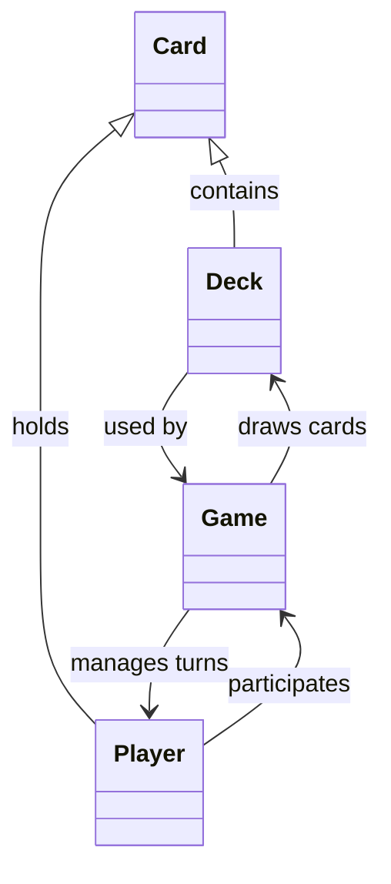
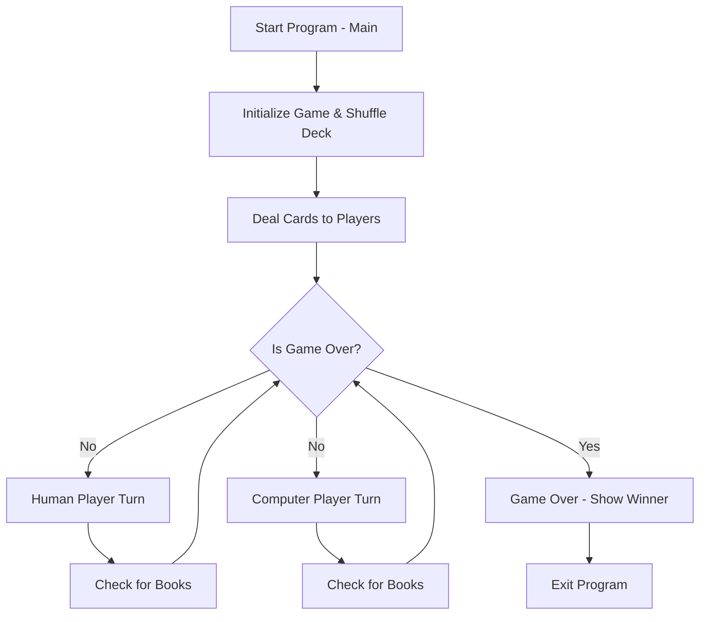

# Go Fish C# – Project Outline

## **1. Overview**

This project is a console-based implementation of **Go Fish** in C#. It demonstrates object-oriented programming, collection management, game logic, and basic AI for a computer opponent. The program is structured into multiple classes, each responsible for a specific part of the game.

## **2. File & Class Breakdown**

### **1) `Card.cs`**

**Purpose:**  
Represents a single playing card with a `Suit` and `Rank`. Handles the string representation of the card for console display.

**Key Methods/Properties:**

- `Suit` (string) – Hearts, Diamonds, Clubs, Spades.
- `Rank` (string) – 2–10, J, Q, K, A.
- `ToString()` – Returns human-readable format for display.

### **2) `Deck.cs`**

**Purpose:**  
Manages the collection of 52 cards, shuffling, and drawing cards.

**Key Methods:**

- `Shuffle()` – Randomizes the order of cards.
- `Draw()` – Removes and returns the top card from the deck.
- `Count()` – Returns the number of cards remaining in the deck.

### **3) `Player.cs`**

**Purpose:**  
Represents a player (human or computer), their hand, and the books they collect. Encapsulates actions a player can perform.

**Key Methods/Properties:**

- `Hand` – `List<Card>` representing current cards.
- `Books` – `List<string>` tracking completed sets of 4 cards.
- `AddCard(Card c)` – Adds a card to the hand.
- `RemoveCardsByRank(string rank)` – Removes all cards of a specific rank.
- `CountRank(string rank)` – Returns how many cards of a rank the player holds.
- `CheckForBooks()` – Detects and removes completed books from hand.

### **4) `Game.cs`**

**Purpose:**  
Controls the overall game logic, turn order, player interactions, and end-game scoring.

**Key Methods:**

- `Play()` – Runs the main game loop until all cards are collected.
- `PlayerTurn(Player current, Player opponent)` – Handles a player’s turn, including asking for cards, drawing, and checking for books.

**Responsibilities:**

- Alternates turns between human and computer.
- Manages deck state and card transfers between players.
- Declares the winner at the end.

### **5) `Program.cs`**

**Purpose:**  
Entry point for the console application. Initializes the game and starts gameplay.

**Typical Content:**
class Program  

```cs
{  
    static void Main()  
    {  
        Game game = new Game();  
        game.Play();  
    }  
}
```

## **3. Class Interaction Diagram (Mermaid)**



**Explanation:**

- `Deck` contains multiple `Card` objects.
- `Player` holds `Card` objects in `Hand`.
- `Game` controls `Player` objects and draws cards from the `Deck`.
- `Program.cs` simply initializes `Game` and starts the loop.

## **4. Program Flow (Mermaid Flowchart)**



**Flow Explanation:**

1. Program starts at `Main()` in `Program.cs`.
2. `Game` object is initialized, deck is shuffled, and cards are dealt.
3. Game loop alternates between **Human** and **Computer** turns.
4. On each turn, the player asks for a rank, draws cards if needed, and checks for completed books.
5. The loop continues until all cards/books are collected.
6. The winner is determined and displayed, then the program exits.
